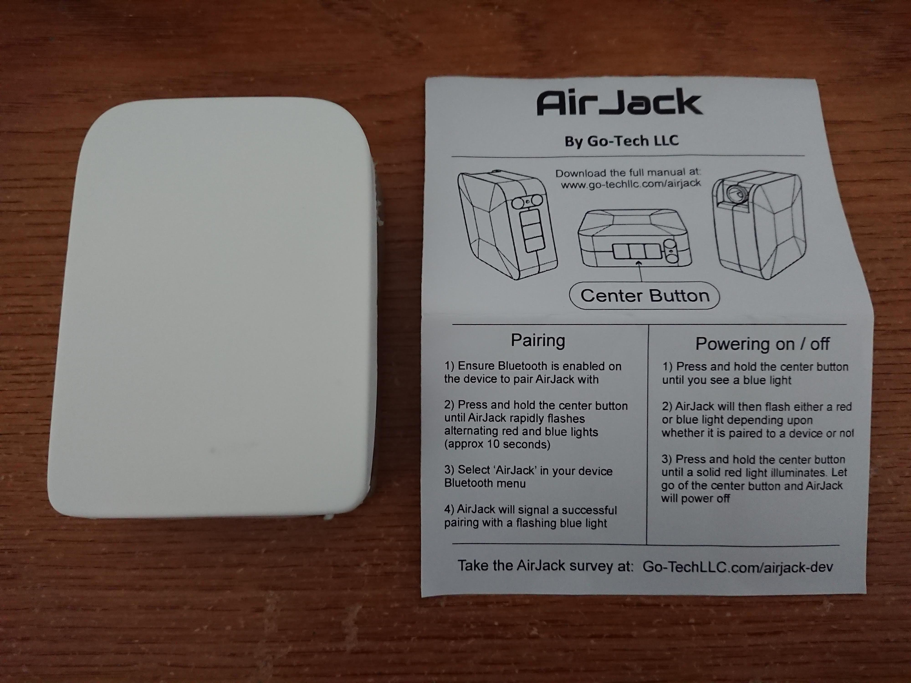
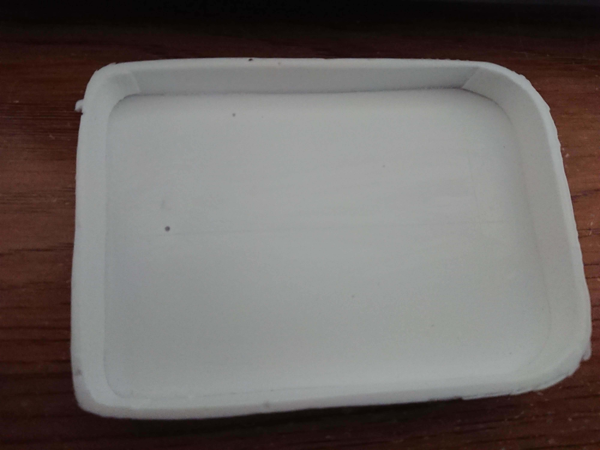
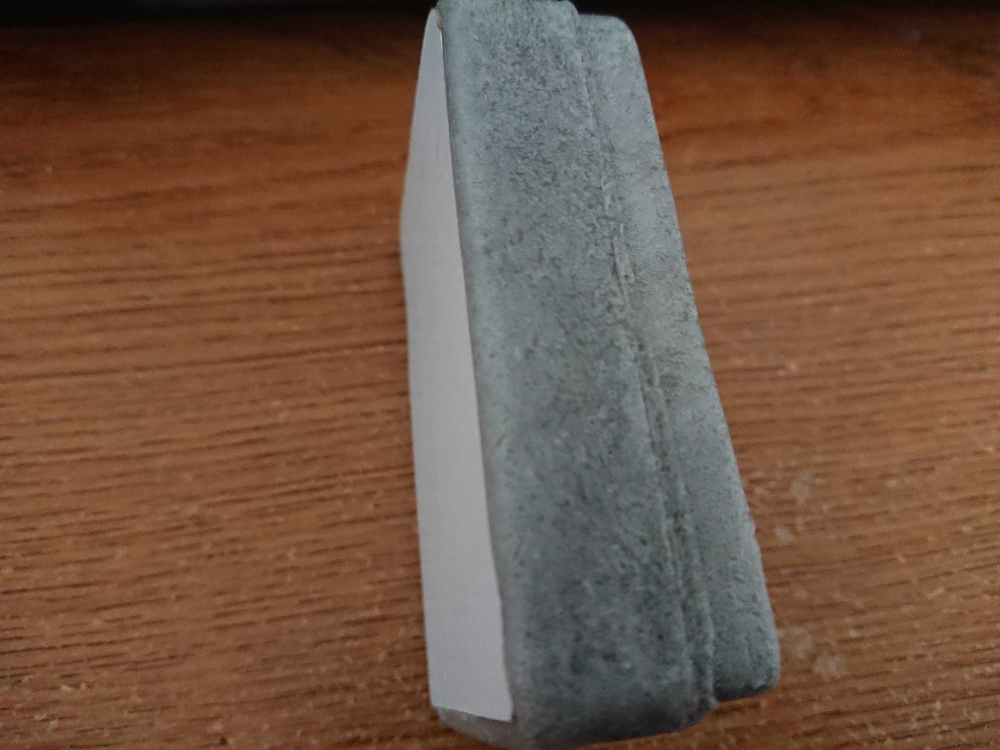
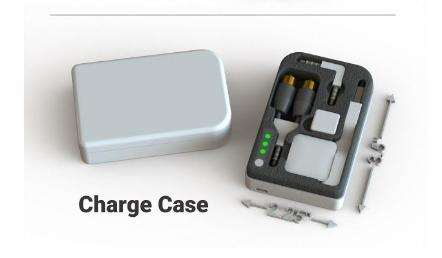
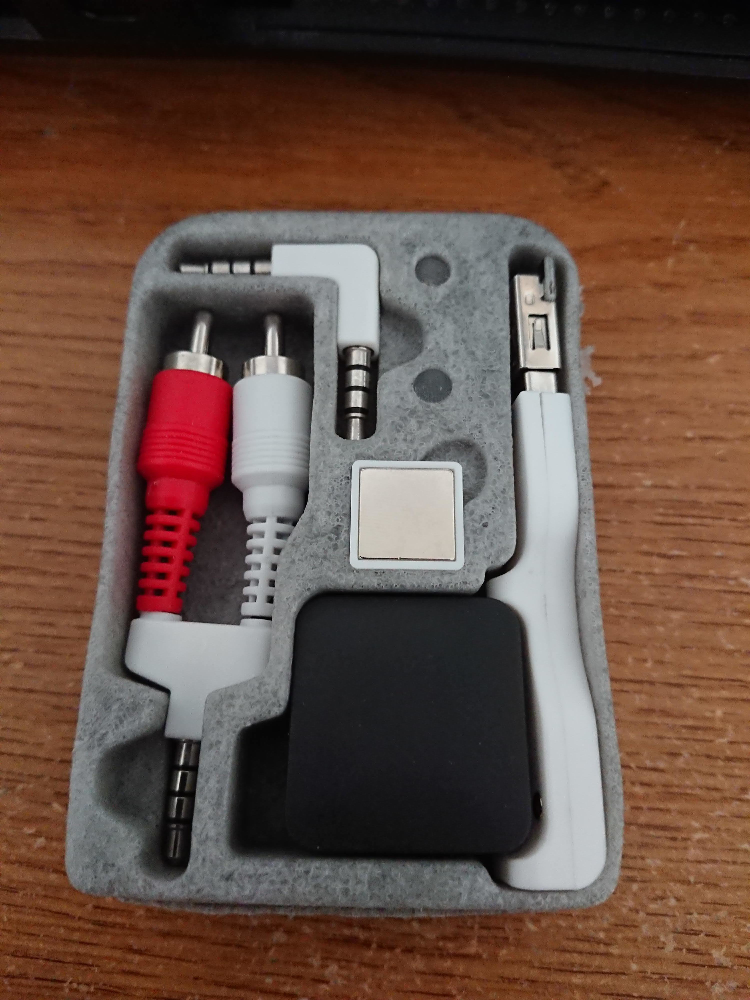
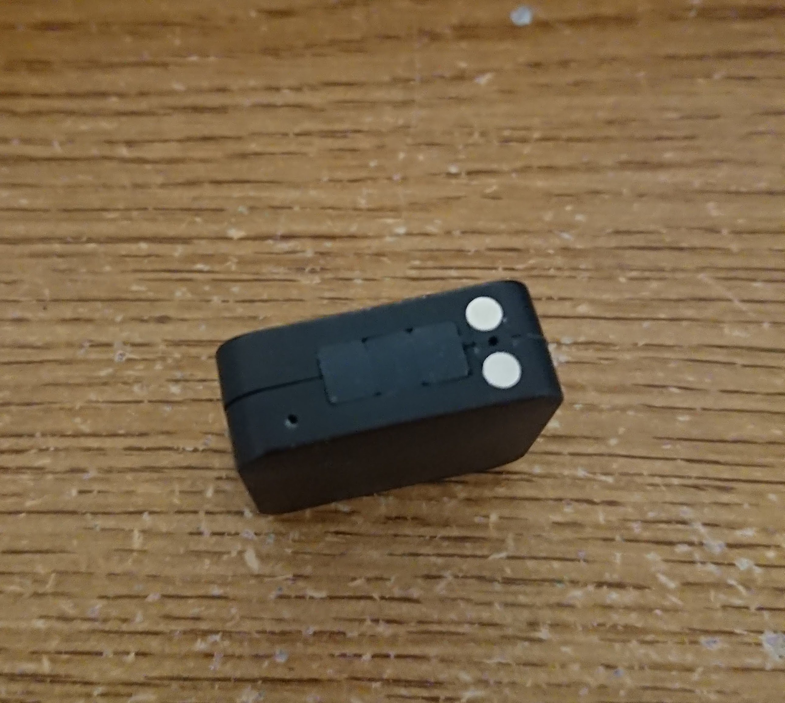
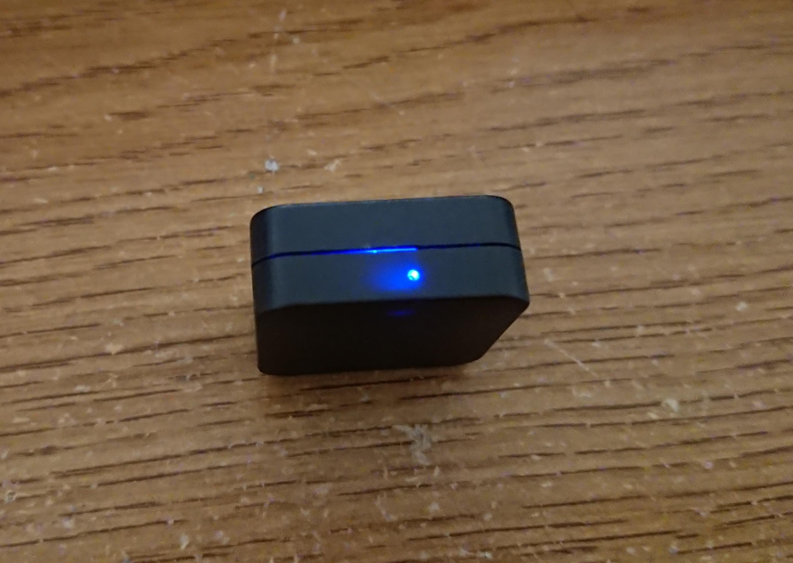
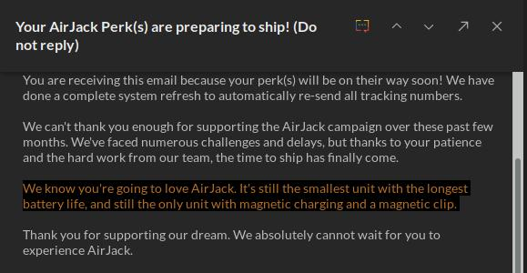

<a href="#en">Chinglish version</a>  
<a href="#zh">中文</a>

For those who don't know what AirJack is, it is a device that can make any headphone with 3.5mm plug a Bluetooth headphone. It's basically a Bluetooth audio receiver.

I received it yesterday. I've waited for a loooooooong time. [Go-Tech LLC](https://go-techllc.com) promised to ship around May 2017 when I back the project on [Indiegogo](https://www.indiegogo.com/projects/airjack-bluetooth-for-any-audio-device-headphones#/), but they did not. Then I received a tracking number in February 2018, but I didn't see any update until six days ago (May 21, 2018). So finally, it arrived, in a small packet.

(Yes, I've bought the charging case.)

It was very disappointing that the build quality (of the case) is extremely terrible. The lid was made of soft plastic, the thickness of it is uneven, and cutting is... terrible, with lots of burr on it.

However, compared to the case itself, the lid is still acceptable. The case is entirely made of (low quality) foam, WITHOUT a plastic housing. And on the back is a piece of cardboard glued together... If I press on it, I can see the battery and wires inside of it.

(And there is a big hole under the part which stores the RCA to AUX dongle)

The case is almost completely different from the advertisement, in the picture on the manual, it has a battery indicator, a power button, a plastic housing around the foam part, and a different layout.

This is what in the [manual](https://web.archive.org/web/20180526211740/https://static1.squarespace.com/static/5798c3429f74564be3410f9b/t/5b010c9388251b9376380434/1526795414610/AirJack+Manual+Revision+1.04.pdf):

And this is what I actually get:

Let's talk about functionality. What I expect is I when I put AirJack (The little black cube in the photo above) back into the case, the case should charge it until the battery inside of AirJack is full, or the battery in the case is out of power, and a power button that can toggle the case to charge AirJack or not. But what I actually get is a case that is just a case, it doesn't work AT ALL. Just like the photo above, nothing lights up, nothing is charging. Though at some angle it may work when I moved it a little bit, it stopped working. 

AirJack itself's quality is... acceptable. Everything is fine except a big gap between the two pieces of plastic cases and some burr around the holes. It's definitely not waterproofed, LOL.

It may be a little bit hard to see in the picture, it has three buttons, and two metal contactors for charging. The 3.5mm headphone jack is on the other side. The buttons are extremely tough to push. Hold the "Center Button" to turn it on, and it will have a light on another side, through a small hole:

And that's the indicator. I've already paired it with my phone, so it's a blinking blue light. For more details about the usage, please read their [manual](https://static1.squarespace.com/static/5798c3429f74564be3410f9b/t/5b010c9388251b9376380434/1526795414610/AirJack+Manual+Revision+1.04.pdf).

I'm sure it can work, but... not as well as they advertised:  
- Go-Tech LLC claimed it could work 50 feet (around 15 meters) away from the... phone? However, when I put my phone in my right pocket, and AirJack in the left pocket, sometimes the audio become intermittently. Moreover, it will disconnect when I'm around 2 meters away from my phone.
- It claimed to have aptX support, but when I connected to my phone, my phone won't recognize it as an aptX device. My phone automatically selects SBC, not even AAC. I don't know why.

By the way, my phone is SONY Xperia XZ1 Compact, every other Bluetooth headphones I have works fine with it (Even ~~garbage~~ like PowerBeats2 Wireless).

I haven't tested the battery life yet. They claimed AirJack has 32 hours of battery life... But...

And it doesn't have ANY charge protection.

Those dongles in the case probably have the best build quality among all the things I received.

So my opinion to this thing is... not recommended. The price is not low ($32 for early birds at Indiegogo), it's build quality is just terrible, and didn't reach many expectations, especially for the case. If the price goes down or the build quality got a significant improvement, it can be a good product, but right now it's just a... <!--garbage--> If you really want one, you can have a try, but don't buy the case, it's useless.

I'm not loving it as they promised.

Feel free to ask me anything about it in the comments below.  

-----

以下爲中文版：  
這篇文章裏提到的 AirJack 是 [Go-Tech LLC](https://go-techllc.com) 在 [Indiegogo 上衆籌](https://www.indiegogo.com/projects/airjack-bluetooth-for-any-audio-device-headphones#/)的一個能把一般的 3.5mm 接口的有線耳機當藍牙耳機用的設備。也就是說它是一個接收藍牙訊號並解碼然後輸出到 3.5mm 口的設備。

我差不多一年多前就參與了這個衆籌項目，當時做 AirJack 的團隊說會在 17 年 5 月左右發貨，但是並沒有。然後我在 18 年二月份的時候收到了一個物流號碼，但是一直沒有動靜（直到六天前也就是 5 月 21 日）。直到昨天我才收到它...

（沒錯，我買了他們的那個旅行充電盒）

然後就是這東西的做工，實在是太可怕了。我明白你們是衆籌，做工粗糙一點也正常，但是完全沒想到會是這個樣子的。這個盒子的蓋子切割得很爛，厚度不均勻，毛刺也沒去除乾淨。

不過跟盒子本身比這已經算很好了。整個盒子就是一塊很廉價的海綿一樣的東西，外面並沒有像圖片裏那樣的塑料殼子。在背面直接就是一塊粘上去的紙板，如果在那邊按下去甚至還能看到裏面的電池和線。

（在 RCA 到 AUX 轉接線底下還有一個很大的空洞）

可以說是跟宣傳裏的完全不一樣了，[手冊](https://web.archive.org/web/20180526211740/https://static1.squarespace.com/static/5798c3429f74564be3410f9b/t/5b010c9388251b9376380434/1526795414610/AirJack+Manual+Revision+1.04.pdf)裏的宣傳圖裏有電池指示燈，電源鍵，佈局也是不一樣的：

但是現實是這樣的：

再來談談它的功能。看圖片還以爲它能做到當我把 AirJack（也就是盒子裏面那個黑色的小方塊）放進去後自動給它充電，當充滿了之後自動斷開，能通過上面的指示燈看剩餘電量，還有一個開關能控制是否充電。但是現實是骨感的，它啥都沒有，上面僅有的兩個燈一個是表示正在充電，一個表示正在輸出電。而且連基本的充電都做不到，絕大多數時候放進去了啥事都不會發生，只有特定角度下纔能充電進去，但是稍微動一下就又斷開了。

再來說 AirJack 本身，它的做工... 還算可以接受吧，只是縫隙有點大然後部分地方有毛刺（它當然不防水）。

在圖片裏可能有點難看到，它實際上有三個按鈕。另外還有兩個用來充電的金屬觸電。那三個按鈕非常難按，也沒法區分。開機需要長按中間那個鍵好幾秒，開機之後另外一面的一個小孔裏會有燈亮起來。

它就是主要的指示燈了，裏面大概是有一紅一藍兩個 LED，會根據不同情況亮不同顏色的燈。我已經配對好了所以是閃爍的藍色的光。別的具體信息可以看他們的[手冊](https://web.archive.org/web/20180526211740/https://static1.squarespace.com/static/5798c3429f74564be3410f9b/t/5b010c9388251b9376380434/1526795414610/AirJack+Manual+Revision+1.04.pdf)。

它可以正常工作，但是並不像他們宣稱的那麼好...

- 他們宣稱它能在 50 英尺（差不多 15 米）內正常工作，但是事實是我把手機放在右邊褲袋，AirJack 放在左邊褲袋就已經出現斷斷續續的情況了，離開兩米左右就已經斷開連接了。
- 他們宣稱它有 aptX 支持，但是我的手機並不能正確識別，可選的編碼只有 SBC，連 AAC 都不行。

我的手機是索尼的 Xperia XZ1 Compact，用別的藍牙耳機都能正常工作（即使是 PowerBeats2 Wireless 這樣的~~蠟屐~~），應該不是手機的問題。

並且它沒有任何的充電保護，手冊裏說必須一充滿了就要斷開電源...

我還沒測試過續航，他們宣稱有 32 小時... 但是感覺並不可信...

盒子裏的那些轉接頭可能是所有東西裏面做工最好的了。

所以我對它的綜合評價是... 不推薦購買。首先它並不便宜（Indiegogo 上 Early Bird 價格是 32 刀），做工是相當的爛，也沒有做到他們宣傳裏的很多東西，尤其是這個盒子。除非他們降低價格或是在最終零售版裏提高質量，不然這東西就是絕對的垃圾。如果你很想試試這樣的東西的話也不是不可以買，但是不論如何，不要買那個盒子，就是浪費錢。

我並沒有像他們保證的那樣喜歡上這個設備。

有什麼問題的話歡迎在評論裏提出。
